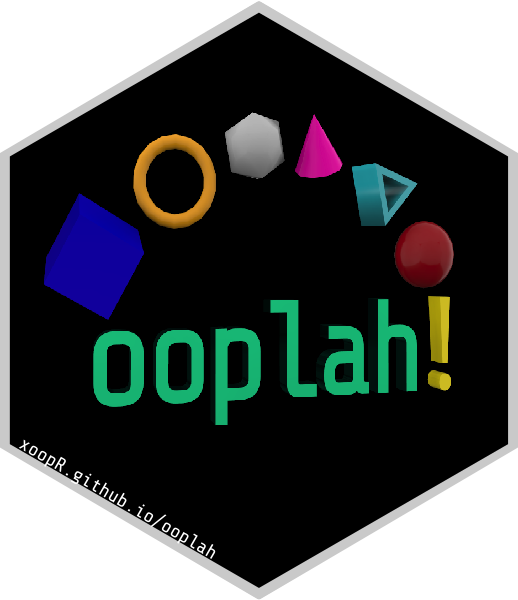

ooplah
================



[](https://cran.r-project.org/package=ooplah)
[](https://cran.r-project.org/web/checks/check_results_ooplah.html)
[](https://github.com/xoopR/ooplah/actions/workflows/check-covr.yml)

[](https://github.com/xoopR/ooplah)
[](https://github.com/xoopR/ooplah)

[](https://cran.r-project.org/package=ooplah)
[](https://app.codecov.io/gh/xoopR/ooplah)
[](https://CRAN.R-project.org/package=ooplah)
[](https://opensource.org/licenses/MIT)

## What is ooplah?

**ooplah** contains helper functions for object-oriented programming in
R, with a focus on R6. These functions are used throughout the xoop
universe but can be useful in any package.

## Installation

For the latest release on
[CRAN](https://CRAN.R-project.org/package=ooplah), install with

``` r
install.packages("ooplah")
```

Otherwise for the latest stable build

``` r
remotes::install_github("xoopR/ooplah")
```

## Future Plans

The **ooplah** API is still experimental and may be subject to major
changes. Currently it’s primary use-case is in other xoopR packages,
minor or major changes will be made to satisfy this dependency. Future
development will then focus on code quality and speed.

## Package Development and Contributing

**ooplah** is released under the [MIT
licence](https://opensource.org/licenses/MIT). We welcome and appreciate
all [new issues](https://github.com/xoopR/ooplah/issues) relating to bug
reports, questions and suggestions. You can also [start a
discussion](https://github.com/xoopR/ooplah/discussions) for more
extensive feedback or feature suggestion.
